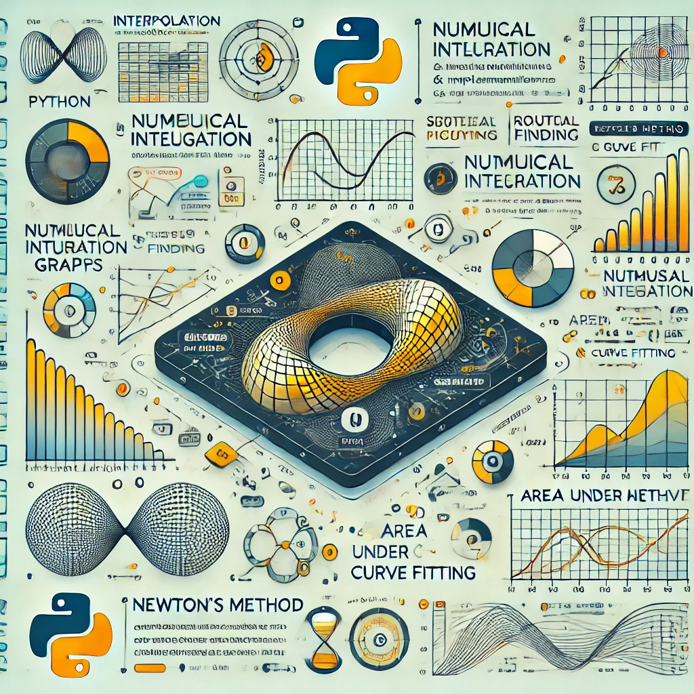

# Advanced Mathematical Algorithms and Implementations

## Overview

This project showcases Python implementations of advanced mathematical problem-solving techniques. It is structured around multiple assignments, each focusing on key topics such as interpolation, numerical integration, curve fitting, and root finding. The implementations emphasize efficiency, accuracy, and handling noisy data in complex mathematical scenarios.

## Features

- **Optimized Mathematical Algorithms**: Implementations include interpolation, root finding, numeric integration, and model fitting techniques.
- **Efficient Computational Methods**: Solutions incorporate well-known algorithms such as Newton’s method, Simpson’s rule, and DBSCAN clustering.
- **Robust Noise Handling**: Strategies for handling noisy datasets ensure reliable and accurate mathematical modeling.
- **Modular Code Structure**: Each assignment is independently executable while sharing core utilities and functions for seamless integration.

## Assignments & Techniques

### **Assignment 1: Function Interpolation**
- **Objective**: Interpolate a given function using minimal points while minimizing error.
- **Techniques Used**:
  - Cubic Spline Interpolation for smooth data transitions.
  - Thomas Algorithm for solving tridiagonal systems efficiently.
- **File**: `assignment1.py`

### **Assignment 2: Finding Intersections**
- **Objective**: Compute intersection points between two functions.
- **Techniques Used**:
  - Newton’s Method for rapid convergence.
  - Bisection Method for added robustness in cases where Newton’s method struggles.
- **File**: `assignment2.py`

### **Assignment 3: Numerical Integration & Area Calculation**
- **Objective**: Perform numerical integration and compute enclosed areas between functions.
- **Techniques Used**:
  - Simpson’s Rule for efficient and accurate integration.
  - Custom handling of multiple intersections for precise area calculation.
- **File**: `assignment3.py`

### **Assignment 4: Model Fitting with Noisy Data**
- **Objective**: Fit a polynomial model to noisy data with minimal error.
- **Techniques Used**:
  - Polynomial Fitting using Vandermonde matrices.
  - Adaptive Sampling to optimize data collection based on noise characteristics.
- **File**: `assignment4.py`

### **Assignment 5: Shape Contour Fitting & Area Calculation**
- **Objective**: Model and calculate the area of complex shapes.
- **Techniques Used**:
  - DBSCAN Clustering to filter noisy contour points.
  - Shoelace Theorem for precise area calculations.
  - Radial Sorting for accurate contour point ordering.
- **File**: `assignment5.py`

## Custom Implementations & Utilities

- `functionUtils.py`: Contains function decorators for timing, noise injection, and invocation restrictions.
- `commons.py`: Houses reusable mathematical functions, including noisy function generators and utility methods.
- `sampleFunctions.py`: Provides predefined functions for testing algorithm performance.

## Key Achievements

- **Performance Optimization**: Developed highly efficient algorithms that balance speed and accuracy.
- **Reliable Noise Handling**: Implemented strategies for managing noise in interpolation and model fitting.
- **Scalability & Modularity**: Designed a modular project structure that facilitates independent execution and testing of each assignment.

## Installation & Setup

Ensure Python is installed (tested with Python 3.8).

1. Clone the repository:
   ```bash
   git clone https://github.com/omriarie/Numeric-Analisys.git
   ```
2. Navigate to the project directory:
   ```bash
   cd Numeric-Analisys
   ```
3. Install required dependencies:
   ```bash
   pip install numpy matplotlib
   ```

## Running the Assignments

To run specific assignments, execute:
```bash
python assignmentX.py  # Replace X with the assignment number
```

For automated testing, use:
```bash
python grader.py
```

## Project Structure

- `assignment1.py` – Function interpolation using cubic splines and the Thomas algorithm.
- `assignment2.py` – Root finding using Newton’s and Bisection methods.
- `assignment3.py` – Numeric integration and area calculation using Simpson’s rule.
- `assignment4.py` – Polynomial fitting for noisy data.
- `assignment5.py` – Contour fitting and area calculation with clustering techniques.

This structured approach ensures modularity, reusability, and efficiency in mathematical problem-solving and algorithm development.

